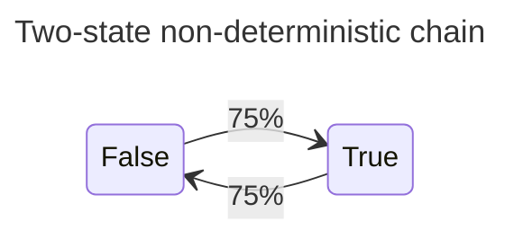
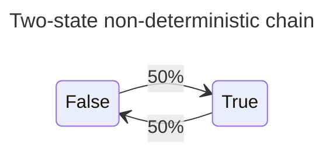

# linked-markov

[](https://crates.io/crates/linked-markov)
[](https://github.com/Gitopolis/linked-markov/actions)
[](./LICENSE)

A minimal, thread-safe Markov chain implementation using reference-counted steps and weighted transitions.

## Features

- Generic over state type `T` (must be `Eq + Copy + Hash + Debug` and `Send + Sync`)
- Transitions are protected by an `RwLock` to allow concurrent reads during traversal.
- Weighted transitions between states
- Non-mutable (`walk`) and mutable (`mut_walk`) traversal utilities

## Quick start

```
cargo add linked-markov
```



```rust
use linked_markov::{Step, ToStep, walk, mut_walk};
use std::sync::Arc;

// Create two states and wire weighted transitions between them.
let step_false: ToStep<bool> = Arc::new(Step::new(false));
let step_true: ToStep<bool> = Arc::new(Step::new(true));

step_false.insert_transition(step_true.clone(), 3);
step_false.insert_transition(step_false.clone(), 1);
step_true.insert_transition(step_false.clone(), 3);
step_true.insert_transition(step_true.clone(), 1);

let path = walk(step_false.clone(), 100);
assert_eq!(path.len(), 100);
```

## Mutable walk example

`mut_walk` accepts a callback that's called for every successful transition. This allows you to mutate transition weights or collect statistics.



```rust
use std::sync::Arc;
use linked_markov::{Step, ToStep, mut_walk};

let step_false: ToStep<bool> = Arc::new(Step::new(false));
let step_true: ToStep<bool> = Arc::new(Step::new(true));

step_false.insert_transition(step_true.clone(), 1);
step_false.insert_transition(step_false.clone(), 1);
step_true.insert_transition(step_false.clone(), 1);
step_true.insert_transition(step_true.clone(), 1);

let path = mut_walk(step_false.clone(), 100, |current, next| {
  current
    .transitions
    .write()
    .unwrap()
    .entry(next)
    .and_modify(|e| *e += 1)
    .or_insert(1);
  Ok(())
}).unwrap();

let step_true_count = step_true.transitions.read().unwrap().values().sum::<usize>();
let step_false_count = step_false.transitions.read().unwrap().values().sum::<usize>();
assert_eq!(path.len(), 100);
assert_eq!(step_true_count + step_false_count, 103);
```

## Multi-Thread Example

Read 3 sonnets in three different threads, and create a single markov chain with 223 states:

```mermaid
---
title: Shakespeare's Sonnets
---
stateDiagram-v2
  direction LR
state "Or" as Or
Or --> who: 100%
state "creatures" as creatures
creatures --> we: 100%
state "bud" as bud
bud --> buriest: 100%
state "dost" as dost
dost --> beguile: 100%
state "use," as use,
use, --> If: 100%
state "he" as he
he --> so: 100%
state "eat" as eat
eat --> the: 100%
state "through" as through
through --> windows: 100%
state "it" as it
it --> cold.: 100%
state "renewest," as renewest,
renewest, --> Thou: 100%
state "cold." as cold.
state "grave" as grave
grave --> and: 100%
state "eyes," as eyes,
eyes, --> Were: 50%
eyes, --> Feed'st: 50%
state "small" as small
small --> worth: 100%
state "Thou" as Thou
Thou --> that: 33%
Thou --> dost: 33%
Thou --> art: 33%
state "in" as in
in --> thy: 50%
in --> niggarding.: 25%
in --> thee: 25%
state "time" as time
time --> that: 50%
time --> decease,: 50%
state "thine" as thine
thine --> age: 25%
thine --> own: 75%
state "foe," as foe,
foe, --> to: 100%
state "should" as should
should --> form: 50%
should --> by: 50%
state "field," as field,
field, --> Thy: 100%
state "heir" as heir
heir --> might: 100%
state "Will" as Will
Will --> be: 100%
state "Where" as Where
Where --> all: 100%
state "For" as For
For --> where: 100%
state "worth" as worth
worth --> held: 100%
state "to" as to
to --> the: 16%
to --> be,: 16%
to --> thy: 16%
to --> be: 16%
to --> stop: 16%
to --> thine: 16%
state "brow," as brow,
brow, --> And: 100%
state "who" as who
who --> is: 100%
state "where" as where
where --> is: 33%
where --> abundance: 33%
where --> all: 33%
state "When" as When
When --> forty: 100%
state "Disdains" as Disdains
Disdains --> the: 100%
state "Within" as Within
Within --> thine: 100%
state "whose" as whose
whose --> unear'd: 100%
state "abundance" as abundance
abundance --> lies,: 100%
state "might" as might
might --> never: 50%
might --> bear: 50%
state "thereby" as thereby
thereby --> beauty's: 100%
state "deserved" as deserved
deserved --> thy: 100%
state "say," as say,
say, --> within: 100%
state "she" as she
she --> so: 50%
she --> in: 50%
state "we" as we
we --> desire: 100%
state "Were" as Were
Were --> an: 100%
state "fond" as fond
fond --> will: 100%
state "makest" as makest
makest --> waste: 100%
state "ask'd" as ask'd
ask'd --> where: 100%
state "buriest" as buriest
buriest --> thy: 100%
state "Pity" as Pity
Pity --> the: 100%
state "be," as be,
be, --> To: 100%
state "April" as April
April --> of: 100%
state "Despite" as Despite
Despite --> of: 100%
state "world," as world,
world, --> unbless: 50%
world, --> or: 50%
state "that" as that
that --> art: 50%
that --> face: 50%
state "How" as How
How --> much: 100%
state "fuel," as fuel,
fuel, --> Making: 100%
state "made" as made
made --> when: 100%
state "back" as back
back --> the: 100%
state "sum" as sum
sum --> my: 100%
state "Thyself" as Thyself
Thyself --> thy: 100%
state "thine!" as thine!
thine! --> This: 100%
state "blood" as blood
blood --> warm: 100%
state "an" as an
an --> alleating: 100%
state "self-love," as selflove,
selflove, --> to: 100%
state "or" as or
or --> else: 100%
state "From" as From
From --> fairest: 100%
state "art" as art
art --> now: 33%
art --> thy: 33%
art --> old,: 33%
state "livery," as livery,
livery, --> so: 100%
state "self" as self
self --> too: 100%
state "praise." as praise.
praise. --> How: 100%
state "bright" as bright
bright --> eyes,: 100%
state "world's" as world's
world's --> fresh: 50%
world's --> due,: 50%
state "thriftless" as thriftless
thriftless --> praise.: 100%
state "lusty" as lusty
lusty --> days,: 100%
state "To" as To
To --> eat: 50%
To --> say,: 50%
state "cruel." as cruel.
cruel. --> Thou: 100%
state "gaudy" as gaudy
gaudy --> spring,: 100%
state "'This" as 'This
'This --> fair: 100%
state "this" as this
this --> thy: 50%
this --> glutton: 50%
state "count" as count
count --> and: 100%
state "were" as were
were --> to: 100%
state "proud" as proud
proud --> livery,: 100%
state "memory:" as memory
memory --> But: 100%
state "due," as due,
due, --> by: 100%
state "too" as too
too --> cruel.: 100%
state "deep" as deep
deep --> trenches: 100%
state "tender" as tender
tender --> churl,: 50%
tender --> heir: 50%
state "glass," as glass,
glass, --> and: 100%
state "beguile" as beguile
beguile --> the: 100%
state "if" as if
if --> thou: 50%
if --> now: 50%
state "couldst" as couldst
couldst --> answer: 100%
state "make" as make
make --> my: 100%
state "prime:" as prime
prime --> So: 100%
state "Shall" as Shall
Shall --> sum: 100%
state "within" as within
within --> thine: 100%
state "live," as live,
live, --> remember'd: 100%
state "dig" as dig
dig --> deep: 100%
state "light'st" as light'st
light'st --> flame: 100%
state "on" as on
on --> now,: 100%
state "mother's" as mother's
mother's --> glass,: 100%
state "fair" as fair
fair --> whose: 50%
fair --> child: 50%
state "sweet" as sweet
sweet --> self: 100%
state "deep-sunken" as deepsunken
deepsunken --> eyes,: 100%
state "else" as else
else --> this: 100%
state "excuse,'" as excuse,'
excuse,' --> Proving: 100%
state "never" as never
never --> die,: 100%
state "a" as a
a --> famine: 50%
a --> tatter'd: 50%
state "tillage" as tillage
tillage --> of: 100%
state "increase," as increase,
increase, --> That: 100%
state "Feed'st" as Feed'st
Feed'st --> thy: 100%
state "This" as This
This --> were: 100%
state "answer" as answer
answer --> 'This: 100%
state "is" as is
is --> the: 33%
is --> she: 33%
is --> he: 33%
state "gazed" as gazed
gazed --> on: 100%
state "beauty" as beauty
beauty --> by: 50%
beauty --> lies,: 50%
state "ornament" as ornament
ornament --> And: 100%
state "being" as being
being --> ask'd: 100%
state "with" as with
with --> selfsubstantial: 100%
state "husbandry?" as husbandry?
husbandry? --> Or: 100%
state "tell" as tell
tell --> the: 100%
state "Now" as Now
Now --> is: 100%
state "spring," as spring,
spring, --> Within: 100%
state "fresh" as fresh
fresh --> repair: 50%
fresh --> ornament: 50%
state "old" as old
old --> excuse,': 100%
state "shame" as shame
shame --> and: 100%
state "time." as time.
time. --> But: 100%
state "womb" as womb
womb --> Disdains: 100%
state "now" as now
now --> thou: 50%
now --> the: 50%
state "so" as so
so --> gazed: 33%
so --> fair: 33%
so --> fond: 33%
state "all-eating" as alleating
alleating --> shame: 100%
state "treasure" as treasure
treasure --> of: 100%
state "now," as now,
now, --> Will: 100%
state "golden" as golden
golden --> time.: 100%
state "Then" as Then
Then --> being: 100%
state "But" as But
But --> as: 33%
But --> thou,: 33%
But --> if: 33%
state "when" as when
when --> thou: 100%
state "Whose" as Whose
Whose --> fresh: 100%
state "beseige" as beseige
beseige --> thy: 100%
state "her" as her
her --> prime: 100%
state "wrinkles" as wrinkles
wrinkles --> this: 100%
state "winters" as winters
winters --> shall: 100%
state "And" as And
And --> only: 33%
And --> see: 33%
And --> dig: 33%
state "thee" as thee
thee --> Calls: 100%
state "Look" as Look
Look --> in: 100%
state "the" as the
the --> world's: 15%
the --> gaudy: 7%
the --> world,: 15%
the --> grave: 7%
the --> tillage: 7%
the --> time: 7%
the --> treasure: 7%
the --> tomb: 7%
the --> riper: 7%
the --> face: 7%
the --> lovely: 7%
state "His" as His
His --> tender: 100%
state "Making" as Making
Making --> a: 100%
state "much" as much
much --> more: 100%
state "glutton" as glutton
glutton --> be,: 100%
state "riper" as riper
riper --> should: 100%
state "more" as more
more --> praise: 100%
state "Proving" as Proving
Proving --> his: 100%
state "churl," as churl,
churl, --> makest: 100%
state "age" as age
age --> shall: 100%
state "his" as his
his --> selflove,: 33%
his --> beauty: 33%
his --> memory: 33%
state "So" as So
So --> thou: 100%
state "unbless" as unbless
unbless --> some: 100%
state "Thy" as Thy
Thy --> youth's: 100%
state "praise" as praise
praise --> deserved: 100%

as --> the: 100%
state "contracted" as contracted
contracted --> to: 100%
state "unear'd" as unear'd
unear'd --> womb: 100%
state "die," as die,
die, --> But: 100%
state "forty" as forty
forty --> winters: 100%
state "bear" as bear
bear --> his: 100%
state "thou," as thou,
thou, --> contracted: 100%
state "self-substantial" as selfsubstantial
selfsubstantial --> fuel,: 100%
state "mother." as mother.
mother. --> For: 100%
state "niggarding." as niggarding.
niggarding. --> Pity: 100%
state "my" as my
my --> count: 50%
my --> old: 50%
state "held:" as held
held --> Then: 100%
state "warm" as warm
warm --> when: 100%
state "shall" as shall
shall --> beseige: 50%
shall --> see: 50%
state "all" as all
all --> the: 50%
all --> thy: 50%
state "content" as content
content --> And,: 100%
state "fairest" as fairest
fairest --> creatures: 100%
state "rose" as rose
rose --> might: 100%
state "by" as by
by --> time: 33%
by --> the: 33%
by --> succession: 33%
state "own" as own
own --> bright: 33%
own --> bud: 33%
own --> deepsunken: 33%
state "That" as That
That --> thereby: 100%
state "famine" as famine
famine --> where: 100%
state "repair" as repair
repair --> if: 100%
state "will" as will
will --> be: 100%
state "stop" as stop
stop --> posterity?: 100%
state "desire" as desire
desire --> increase,: 100%
state "And," as And,
And, --> tender: 100%
state "child" as child
child --> of: 100%
state "windows" as windows
windows --> of: 100%
state "posterity?" as posterity?
posterity? --> Thou: 100%
state "thy" as thy
thy --> husbandry?: 7%
thy --> blood: 7%
thy --> brow,: 7%
thy --> beauty's: 14%
thy --> glass,: 7%
thy --> content: 7%
thy --> mother's: 7%
thy --> golden: 7%
thy --> foe,: 7%
thy --> sweet: 7%
thy --> light'st: 7%
thy --> beauty: 7%
thy --> lusty: 7%
state "feel'st" as feel'st
feel'st --> it: 100%
state "of" as of
of --> thine: 14%
of --> mine: 14%
of --> her: 14%
of --> small: 14%
of --> thy: 28%
of --> wrinkles: 14%
state "remember'd" as remember'd
remember'd --> not: 100%
state "days," as days,
days, --> To: 100%
state "tatter'd" as tatter'd
tatter'd --> weed,: 100%
state "Calls" as Calls
Calls --> back: 100%
state "succession" as succession
succession --> thine!: 100%
state "new" as new
new --> made: 100%
state "old," as old,
old, --> And: 100%
state "not" as not
not --> renewest,: 50%
not --> to: 50%
state "form" as form
form --> another;: 100%
state "flame" as flame
flame --> with: 100%
state "see" as see
see --> thy: 50%
see --> Despite: 50%
state "thee." as thee.
state "thou" as thou
thou --> through: 14%
thou --> art: 14%
thou --> live,: 14%
thou --> feel'st: 14%
thou --> not: 14%
thou --> couldst: 14%
thou --> viewest: 14%
state "lies," as lies,
lies, --> Where: 50%
lies, --> Thyself: 50%
state "another;" as another;
another; --> Whose: 100%
state "weed," as weed,
weed, --> of: 100%
state "tomb" as tomb
tomb --> Of: 100%
state "and" as and
and --> make: 20%
and --> thriftless: 20%
and --> tell: 20%
and --> thee.: 20%
and --> she: 20%
state "beauty's" as beauty's
beauty's --> field,: 33%
beauty's --> use,: 33%
beauty's --> rose: 33%
state "face" as face
face --> should: 50%
face --> thou: 50%
state "mine" as mine
mine --> Shall: 100%
state "only" as only
only --> herald: 100%
state "viewest" as viewest
viewest --> Now: 100%
state "be" as be
be --> new: 33%
be --> a: 33%
be --> the: 33%
state "some" as some
some --> mother.: 100%
state "Of" as Of
Of --> his: 100%
state "waste" as waste
waste --> in: 100%
state "youth's" as youth's
youth's --> proud: 100%
state "If" as If
If --> thou: 100%
state "lovely" as lovely
lovely --> April: 100%
state "trenches" as trenches
trenches --> in: 100%
state "decease," as decease,
decease, --> His: 100%
state "herald" as herald
herald --> to: 100%
```



## Public API (summary)

- `Step<T>`: Node holding a `state` and `transitions`.
- `ToStep<T>`: `Arc<Step<T>>` — shared pointer to a step.
- `Step::new(state: T) -> Step<T>`: create a new step.
- `Step::insert_transition(&self, to_step: ToStep<T>, weight: usize)`: add or update a weighted transition.
- `Step::next(&self) -> Option<ToStep<T>>`: choose the next step randomly by weights.
- `walk(start: ToStep<T>, steps: usize) -> Vec<T>`: traverse and return visited states.
- `mut_walk(start: ToStep<T>, steps: usize, apply: F) -> Result<Vec<T>, Box<dyn std::error::Error>>`: traverse while calling `apply(current, next)` for every transition.

Notes on concurrency and lifetimes:

- Transitions are stored in an `RwLock`-protected map. Readers (e.g. `Step::next`) acquire a read lock allowing concurrent selections, while mutations (insertion or updates) acquire a write lock.
- Transition entries hold `Arc<Step<T>>` strong references by default, so transitions keep destination steps alive. If you prefer non-owning references, consider using `Weak<Step<T>>` in the map and `upgrade()` during selection.

## Docs & tests

Generate API docs:

```bash
cargo doc --open
```

Run tests:

```bash
cargo test
```

## License

This project is dedicated to the public domain under the Creative Commons
CC0 1.0 Universal public domain dedication. See the repository `LICENSE`
file for the full legal text.

Short summary: the author has waived all copyright and related rights to
the extent possible under law. See `LICENSE` for details.

## Contributing

Contributions are welcome. By submitting a pull request or other
contribution you agree to license your contribution under the same
CC0 1.0 Universal dedication used by this repository. In short, you
waive copyright and related rights in your contribution to the extent
possible under law.

Quick dev commands:

```bash
# run tests
cargo test

# build docs locally
cargo doc --no-deps --open

# format
cargo fmt

# run clippy
cargo clippy --all-targets --all-features -- -D warnings
```
